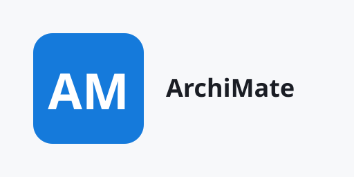

# Awesome ArchiMate [](https://awesome.re)

<p align="right">
  <a href="https://jgsystemsconsulting.github.io/awesome-archimate/">
    
  </a>
</p>

> A curated, vetted, dated list of ArchiMate resources: Open Group specifications and
> certification, the Archi tool and its plugins, books, and openable example models.


Part of the awesome-mbse list family; the registry and family rules live in FAMILY.md
in the jgsystemsconsulting/awesome-mbse repository.

Maintained by [JG Systems Consulting Ltd.](https://github.com/jgsystemsconsulting).
See [Editorial neutrality](CONTRIBUTING.md#editorial-neutrality).

## Contents

- [Specifications and standards](#specifications-and-standards)
- [Certification](#certification)
- [The Archi tool](#the-archi-tool)
- [Plugins and collaboration](#plugins-and-collaboration)
- [Books](#books)
- [Example models](#example-models)
- [TOGAF alignment](#togaf-alignment)
- [Communities](#communities)
- [Install](#install)
- [Usage](#usage)
- [Support](#support)
- [Version](#version)

## Specifications and standards

- [ArchiMate 3.2 Specification](https://publications.opengroup.org/c226) - The Open Group standard defining the ArchiMate 3.2 modeling language, document C226 `ArchiMate3` `spec` (2022).
- [ArchiMate 4 Specification](https://publications.opengroup.org/c260) - The Open Group standard defining the ArchiMate 4 modeling language, document C260, published April 2026 `ArchiMate4` `spec` (2026).
- [ArchiMate Model Exchange File Format](https://www.opengroup.org/open-group-archimate-model-exchange-file-format) - The Open Group specification for the XML-based interchange format for ArchiMate models `ArchiMate-general` `spec` (2026).

## Certification

- [ArchiMate Certification](https://www.opengroup.org/certifications/archimate) - The Open Group certification program for individuals: Foundation and Practitioner levels `ArchiMate-general` `certification` (2026).
- [ArchiMate Tool Certification](https://www.opengroup.org/certifications/archimate/tools) - The Open Group certification program for ArchiMate modeling tools `ArchiMate-general` `certification` (2026).

## The Archi tool

- [Archi](https://github.com/archimatetool/archi) - Open-source ArchiMate modeling tool for Windows, macOS, and Linux, with full ArchiMate 3.2 support `ArchiMate3` `Archi` `tool` (2026).
- [Archi Wiki](https://github.com/archimatetool/archi/wiki) - Official Archi wiki: user guides, how-tos, and plugin documentation `ArchiMate-general` `Archi` `docs` (2026).

## Plugins and collaboration

- [Archi plugins](https://www.archimatetool.com/plugins/) - Catalog of official Archi plugins: jArchi scripting, coArchi collaboration, visualization, and more `ArchiMate-general` `Archi` `plugin` (2026).
- [jArchi](https://github.com/archimatetool/archi-scripting-plugin) - Official Archi scripting plugin: automate model queries, reports, and content generation with JavaScript `ArchiMate-general` `Archi` `plugin` (2026).
- [coArchi](https://github.com/archimatetool/archi-modelrepository-plugin) - Archi plugin adding Git-based model collaboration: shared repositories, commits, and compare `ArchiMate-general` `Archi` `plugin` (2026).
- [coArchi 2](https://github.com/archimatetool/archi-modelrepository-plugin2) - Second-generation coArchi plugin for Git-based shared model repositories in Archi `ArchiMate-general` `Archi` `plugin` (2026).

## Books

- [Mastering ArchiMate](https://ea.rna.nl/mastering-archimate-edition-3-2/) - Gerben Wierda's practitioner book on ArchiMate, Edition 3.2 (PDF released October 2024), with free overview PDFs `ArchiMate3` `book` (2024).

## Example models

- [ArchiModels](https://github.com/archimatetool/ArchiModels) - Archived official collection of example ArchiMate models that open in Archi; kept as reference material `ArchiMate3` `Archi` `has-model` `example` (2021).
- [ArchiSurance Practice](https://github.com/yasenstar/ArchiSurance_Practice) - Community practice models recreating the ArchiSurance case study in Archi `ArchiMate3` `Archi` `has-model` `example` (2026).
- [ArchiSurance (archimate-models)](https://github.com/archimate-models/archisurance) - The ArchiSurance example model from the ArchiMate specification, packaged for Archi `ArchiMate3` `Archi` `has-model` `example` (2017).

## TOGAF alignment

- [TOGAF](https://www.opengroup.org/togaf) - The Open Group TOGAF standard hub; TOGAF is the enterprise architecture method ArchiMate viewpoints serve `ArchiMate-general` `TOGAF` `standard` (2026).

## Communities

- [Archi forum](https://forum.archimatetool.com/) - Community support forum for Archi users: troubleshooting, plugin discussion, and scripting help `ArchiMate-general` `Archi` `community` (2026).

## Contributing

Contributions welcome: see [CONTRIBUTING.md](CONTRIBUTING.md) for the inclusion bar,
entry format, and tag vocabulary.

## Install

Nothing to install. This list is a curated index: browse it here on GitHub,
or clone it:

```bash
git clone https://github.com/jgsystemsconsulting/awesome-archimate.git
```

## Usage

1. Open the Contents at the top and jump to a section, or search the page with
   your browser's find function.
2. Open any entry's link to reach the upstream resource; the list never
   re-hosts content.
3. To suggest a resource or report a defect, use the Support channels below
   (or open a pull request that follows CONTRIBUTING.md).

## Support

- Bug or dead link: [bug report form](https://github.com/jgsystemsconsulting/awesome-archimate/issues/new?template=bug_report.yml)
- Suggest a resource (the list's improvement channel):
  [suggestion form](https://github.com/jgsystemsconsulting/awesome-archimate/issues/new?template=suggest-resource.yml)
- Security issues: [private security advisory](https://github.com/jgsystemsconsulting/awesome-archimate/security/advisories/new)
  (see [SECURITY.md](SECURITY.md))
- Capella and Arcadia resources belong on the sibling list:
  [awesome-capella issues](https://github.com/jgsystemsconsulting/awesome-capella/issues)

## Version

Current release: **0.1.0** (2026-09-17). See [CHANGELOG.md](CHANGELOG.md) and
[RELEASE-INFO.txt](RELEASE-INFO.txt).
